# Compare Code - Architecture

## Overview

**Compare Code** is a sophisticated VS Code extension that provides advanced code comparison capabilities with visual diff highlighting, multi-language support, and seamless integration across multiple editors. The extension features a modular architecture designed for performance, maintainability, and extensibility.

## How it Works

When a user activates the **Compare Code** extension:

1. The `package.json` registers commands and keybindings through the `contributes` field
2. The **Extension Host** loads the main extension module and initializes the webview panel
3. The **Comparison Engine** processes text inputs using advanced algorithms (LCS, Jaccard similarity)
4. The **UI Manager** renders the comparison results with syntax highlighting and interactive features
5. The **Internationalization System** provides localized content based on user preferences
6. Supporting services handle user interactions, animations, and file operations

> 💡 **Architecture Highlights:**  
> The extension uses a **webview-based architecture** for rich UI capabilities while maintaining VS Code integration. The comparison engine implements **Longest Common Subsequence (LCS)** algorithms with **token-level diffing** for precise change detection.

---

## Architecture Diagram

```mermaid
graph TB
    subgraph "📦 Compare Code Extension"
        direction TB
        A[package.json<br/>📋 Extension Manifest]
        
        subgraph "🔧 Core Extension Layer"
            direction LR
            B[extension.ts<br/>🚀 Entry Point]
            C[compareView.ts<br/>🖼️ Webview Manager]
        end
        
        subgraph "⚙️ Service Layer"
            direction TB
            D[main.ts<br/>🎯 Application Controller]
            
            subgraph "🧮 Comparison Services"
                direction LR
                E[algorithms.ts<br/>🔍 Comparison Engine]
                F[ui-comparator.ts<br/>📝 Editor Manager]
            end
            
            subgraph "👤 User Interaction Services"
                direction LR
                G[user-actions-top.ts<br/>⚡ Primary Actions]
                H[user-actions-bot.ts<br/>🔧 Secondary Actions]
            end
            
            subgraph "🎨 Display Services"
                direction LR
                I[user-view-info.ts<br/>📊 Information Display]
                J[animations.ts<br/>✨ Visual Effects]
            end
        end
        
        subgraph "🌐 Webview UI Layer"
            direction TB
            K[index.html<br/>📄 Main Template]
            
            subgraph "📜 Scripts"
                direction LR
                L[i18n.js<br/>🌍 Internationalization]
                M[iconUpdater.js<br/>🎨 Icon Management]
                N[tooltipManager.js<br/>💬 Tooltip System]
            end
            
            subgraph "🎨 Styling"
                direction LR
                O[main.scss<br/>🎨 Styles Source]
                P[main.css<br/>📱 Compiled Styles]
            end
        end
        
        subgraph "🌍 Localization System"
            direction LR
            Q[en.json<br/>🇺🇸 English]
            R[es.json<br/>🇪🇸 Spanish]
            S[pt.json<br/>🇧🇷 Portuguese]
            T[zh.json<br/>🇨🇳 Chinese]
        end
        
        subgraph "🛠️ Utilities & Types"
            direction LR
            U[types.ts<br/>📝 Type Definitions]
            V[logger.ts<br/>📋 Logging System]
        end
    end
    
    subgraph "🎯 VS Code Integration Layer"
        direction TB
        W[VS Code Extension Host<br/>🏠 Runtime Environment]
        
        subgraph "⚙️ Core Systems"
            direction LR
            X[Webview API<br/>🖼️ UI Rendering]
            Y[Command System<br/>⌨️ Action Handling]
            Z[File System API<br/>📁 File Operations]
        end
        
        AA[User Interface<br/>👤 Visual Output]
    end
    
    %% Main connections
    A --> B
    B --> C
    C --> D
    D --> E
    D --> F
    D --> G
    D --> H
    D --> I
    D --> J
    
    %% UI connections
    C --> K
    K --> L
    K --> M
    K --> N
    K --> O
    O --> P
    
    %% Localization connections
    L --> Q
    L --> R
    L --> S
    L --> T
    
    %% Utility connections
    E --> U
    D --> V
    
    %% Integration connections
    A -.-> W
    C -.-> X
    B -.-> Y
    C -.-> Z
    X --> AA
    Y --> AA
    Z --> AA
    W --> X
    W --> Y
    W --> Z
    
    %% Styling
    classDef mainConfig fill:#ff6b6b,stroke:#333,stroke-width:2px,color:#fff
    classDef coreLayer fill:#4ecdc4,stroke:#333,stroke-width:2px,color:#fff
    classDef services fill:#45b7d1,stroke:#333,stroke-width:2px,color:#fff
    classDef webview fill:#96ceb4,stroke:#333,stroke-width:2px,color:#fff
    classDef integration fill:#feca57,stroke:#333,stroke-width:2px,color:#000
    classDef utilities fill:#a8e6cf,stroke:#333,stroke-width:2px,color:#000
    classDef localization fill:#dda0dd,stroke:#333,stroke-width:2px,color:#000
    
    class A mainConfig
    class B,C coreLayer
    class D,E,F,G,H,I,J services
    class K,L,M,N,O,P webview
    class W,X,Y,Z,AA integration
    class U,V utilities
    class Q,R,S,T localization
```

---

## Core Components

### 🚀 Extension Entry Point
- **extension.ts**: Main activation point, command registration, and lifecycle management
- **compareView.ts**: Webview panel creation, HTML generation, and message handling

### 🧮 Comparison Engine
- **algorithms.ts**: Advanced diff algorithms using LCS and Jaccard similarity
- **ui-comparator.ts**: Editor content management and visual diff rendering
- **Token-level diffing**: Precise change detection at word and character level

### 👤 User Interaction Layer
- **user-actions-top.ts**: Primary actions (compare, reset, clear)
- **user-actions-bot.ts**: Secondary features (scroll sync, language switching)
- **Keyboard shortcuts**: `Ctrl+Enter` (compare), `Escape` (reset), `Shift+Alt+Backspace` (clear)

### 🎨 Display & Animation System
- **user-view-info.ts**: Statistics display and similarity metrics
- **animations.ts**: Confetti effects for perfect matches and visual feedback
- **Dynamic theming**: Automatic icon updates based on VS Code theme

### 🌍 Internationalization
- **Multi-language support**: English, Spanish, Portuguese, Chinese
- **Dynamic loading**: Runtime language switching without restart
- **Extensible system**: Easy addition of new languages

### 🛠️ Utility Systems
- **types.ts**: Comprehensive TypeScript definitions
- **logger.ts**: Centralized logging and debugging
- **Icon management**: Dynamic SVG icon system with theme awareness

---

## Key Features

### 🔍 Advanced Comparison Algorithms
- **Line-level alignment** using improved LCS algorithm
- **Token-level diffing** for precise inline highlighting
- **Similarity scoring** with Jaccard coefficient
- **Perfect match detection** with confetti celebration

### 🎨 Rich Visual Interface
- **Side-by-side comparison** with synchronized scrolling
- **Syntax highlighting** preservation
- **Interactive diff navigation**
- **Responsive design** for different screen sizes

### ⚡ Performance Optimizations
- **Efficient tokenization** with regex-based parsing
- **Lazy loading** of UI components
- **Memory management** with proper cleanup
- **Debounced operations** for smooth interactions

### 🔧 Developer Experience
- **TypeScript throughout** for type safety
- **Modular architecture** for easy maintenance
- **Comprehensive error handling**
- **Extensive logging** for debugging

---

## Integration Points

### 📱 Multi-Editor Support
- **VS Code**: Native integration with full feature set
- **Cursor**: Seamless compatibility
- **Windsurf**: Full functionality support
- **Trae.ai**: AI-enhanced comparison features
- **Kiro**: Advanced development workflow integration

### 🔌 VS Code API Usage
- **Webview API**: Rich UI rendering
- **Command API**: Action registration and execution
- **File System API**: Secure file operations
- **Theme API**: Dynamic styling adaptation
- **Configuration API**: User preference management

---

## Data Flow

1. **User Input** → Extension command triggered
2. **Extension Host** → Webview panel creation
3. **UI Initialization** → Component loading and setup
4. **Content Input** → Text entered in comparison panels
5. **Comparison Trigger** → Algorithm processing initiated
6. **Result Generation** → Diff calculation and formatting
7. **UI Update** → Visual diff rendering with highlights
8. **User Interaction** → Navigation, export, and settings

---

## Security & Best Practices

### 🔒 Security Measures
- **Content Security Policy** for webview protection
- **Input sanitization** for XSS prevention
- **Secure file operations** using VS Code APIs
- **Resource isolation** with proper URI handling

### 📋 Code Quality
- **ESLint configuration** for consistent code style
- **TypeScript strict mode** for type safety
- **Modular design** for maintainability
- **Comprehensive error handling**

---

## Future Extensibility

The architecture supports easy extension for:
- **New comparison algorithms**
- **Additional language support**
- **Custom themes and styling**
- **Plugin system for specialized comparisons**
- **Integration with version control systems**
- **AI-powered comparison insights**