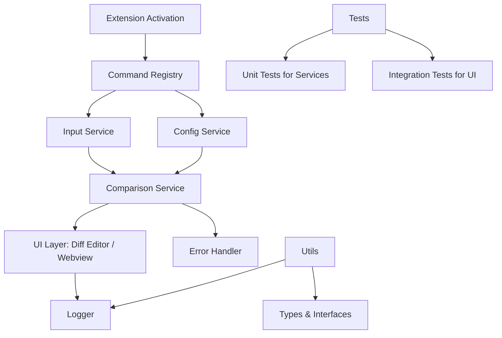

# Current Architecture of the Compare-Code Project

## General Description
This VS Code extension allows efficient code comparison. The current architecture is based on a modular structure with separation of responsibilities between activation, services, user interface, and utilities.

## Current Architecture Diagram


```
src/
├──__test__/              # Tests existentes + nuevos para servicios 
├── services/             # Lógica reutilizable
│   ├── comparisonService.ts  # Calcula diffs (línea por línea o avanzado)
│   ├── inputService.ts       # Maneja selección local/pasteo (y futuro web)
│   └── configService.ts      # Configs de VSCode (e.g., ignore whitespace)
├── ui/                   # Interfaz
│   └── compareView.ts    # Abre diff editor o webview para visualización
├── utils/                # Soporte
│   ├── logger.ts         # Logging para debug
│   └── types.ts          # Interfaces (e.g., IComparisonResult)
└──extension.ts           # Puente: Activa, registra comandos, conecta módulos
```


## Main Components
- **extension.ts**: Entry point that activates the extension and registers commands.
- **Services**: Handle comparison logic, data input, and configuration.
- **UI**: Manages the visualization of differences.
- **Utils**: Provides logging and type definitions.
- **Tests**: Ensure code quality.

# Improved Architecture

## Title: Enhanced Modular Architecture for Code Comparison Extension

## Description 
This improved architecture introduces better modularity, error handling, and scalability. It includes asynchronous operations, a more robust UI layer with webview support, and enhanced services with dependency injection. The structure promotes maintainability and extensibility for future features like multi-language support and cloud integration.

## Improved Architecture Diagram



### Improved Components
- **Asynchronous Operations**: All services now support async/await operations for better performance.
- **Error Handling**: A dedicated module for handling errors and exceptions.
- **Dependency Injection**: Services are injected to facilitate testing and mocking.
- **Enhanced UI**: Support for webview in addition to the native diff editor.
- **Scalability**: Structure prepared to add new services and features.

